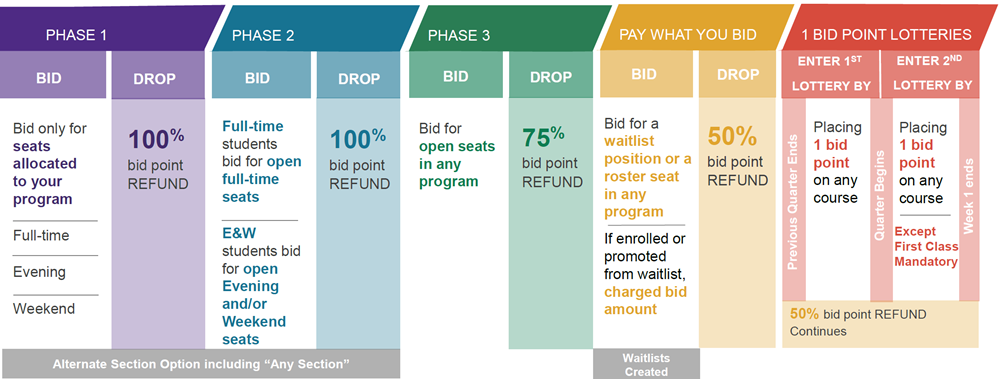
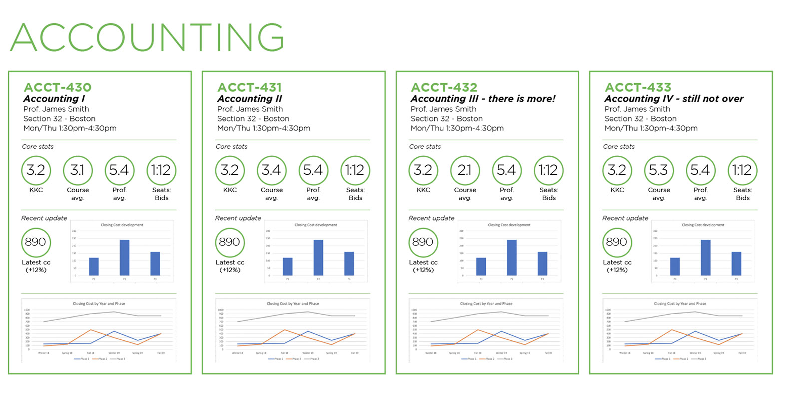
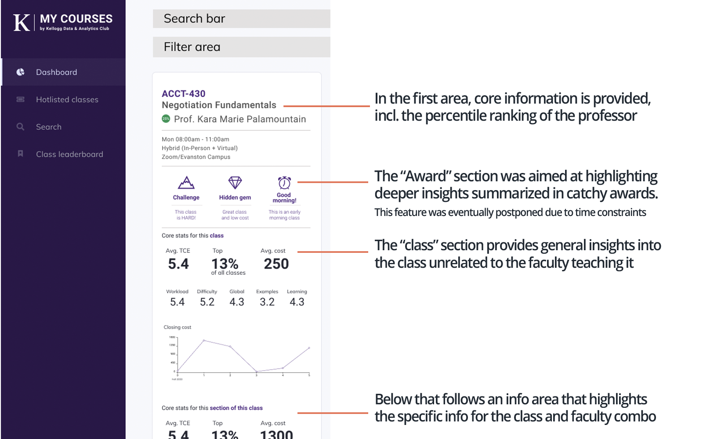
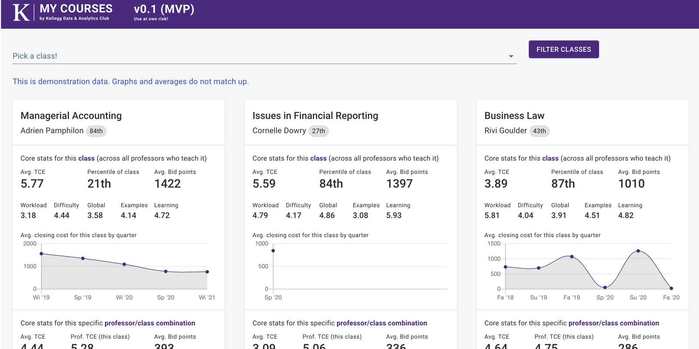

## A stressful process

Picking classes is the single most important determinator of your academic experience at any business school. Many schools have developed what seems to be convoluted, but eventually sensible, systems that provide a class selection process that is as fair as it can be.

As new student, the initial bidding cycle can, however, be overwhelming. Kellogg employs a Dutch bidding system that runs over the course of 5 distinct phases with a bidding and drop cycle each. The below picture, taken from Kellogg's bidding overview system, gives an impression of the complexity involved.

It comes as no surprise that students are scrambling to get a handle on all of this. Kellogg offers many options to guide students in this process:

- Majors and Pathways are lists of specific classes that are connected through a central theme
- Academic advisors help students narrow down their short list and provide bidding advice
- Kellogg's CoursePlanning tool allows students to sift through all offered classes, class times and professors and plan out their schedule
- Quantitative data on bidding statistics from previous quarters and years as well as teacher evaluation scores can be looked at and exported straight from the system.

In addition, inofficial feedback Excels and many many conversations among peers are used to get a gauge of your bidding strategy and goal.

**So, what's the problem?**

As often, the pain starts to come in once students want to go a level deeper. Who is the best teacher at Kellogg (based on quantitative teacher evaluation scores) is a question that takes students about 30-60min of Excel-ing to figure out.

More advanced questions such as "Is class X good because of the professor or the content" can even take longer. While many students have shared make-shift excel files, this data matching process is repeated many many times across all 2300 students at Kellogg.

This is the opportunity that **Kellogg MyCourses** aims to close.

## Post overview

1. Interviews & user personas
2. Prototyping and iteration
3. Data wrangling and analysis
4. Development with React
5. Deployment and Launch
6. Future outlook

## Interviews & user personas

At the start of the journey was the classic first step in any product management journey: Getting to understand the user. While I had my own personal idea of how this tool could shape up, the core lesson of my New Venture Discovery class at Kellogg still rang in my ears: You have to talk to the user.

Through Slack I posted an open call for interviews and was able to put together a group of 10 students to interview.

The interview itself consisted of just a few questions:

1. Walk me through your personal process of how you pick classes?
2. What is most important to you when picking classes?
3. What step in your process is most annoying to you / what do you miss?
4. Provide feedback on an initial wireframe

The first three questions aimed at gaining a solid understanding of people's process and the sources they relied on. The last question was a step to shorten the overall development journey by gathering feedback on a very first iteration of a potential product.

Based on these interviews, I was able to distill three distinct personas:

### The recommendation gatherer

_"If my close friends recommend a class, it is all I need to know"_

**Importance of academics**: Medium  
**Data sophistication**: Low  
**Importance of qualitative data**: High  
**Time spent on finding great classess**: Medium  
**Job to be done:** Find the classes everyone loves  
**Main data pain point:** None (does not care)

- Is driven by a strong desire to take classes that are well regarded
- Is not data-savy or does not care too much about evaluation scores, beyond a basic gut check
- Main source of information are peers and their opinion
- Talk to 10-20 people about their experience, builds course planning off of that list
- Does not overly care of making a "great deal" or "gaming the system" but just spend bid points well enough

### The a-bit-of-everything

_"I try to avoid the worst classes and use all other sources a bit to make decisions"_

**Importance of academics**: Low  
**Data sophistication**: Low  
**Importance of qualitative data**: Medium  
**Time spent on finding great classess**: Low  
**Job to be done:** Avoid the worst for a solid experience  
**Main data pain point:** I don't have the time or skills to get comparisons that should be simple

- No one wants to have bad classes, but finds that "no class is truly horrible" at Kellogg
- Does a bit of everything: Checks some bidding and evaluation scores, talks to some people, talks to the academic advisor, but comes to a conclusion fairly quickly
- Is interested in big picture questions, such as "Is this class better or worse than average", "Will I have to pay 1500 or 500 points for this class"
- Glances at the data for these directional checks without digging deeper into them
- Tends to go with recommendations over their own analysis

### The data-driven planner

_"People who do not analyze historic bidding data are paying significantly more"_

**Importance of academics**: High  
**Data sophistication**: High  
**Importance of qualitative data**: Low  
**Time spent on finding great classess**: High  
**Job to be done:** Maximize the academic experience at the minimal cost  
**Main data pain point:** The data is dirty as hell and takes too much time to analyze

- Highly motivated by the academic experience, with a strong desire to maximize as much as possible
- Uses available historic data as main input
- Creates their own analysis of data although patience is highly tested by low data quality
- Uses significant amount of time to pick bidding strategy
- Knows the bidding system very well and has avoided many bad classes thanks to proper analysis

## Prototyping and iteration

Based on these personas, I was able to narrow down the desired feature set. At its core, I was designing MyCourses for the "A-bit-of-everything". They were the largest group in my sample, a hypothesis I am confident to extend to all of Kellogg, and expressed most often that they just could not pry core insights from the data.

One quote that stuck with me was:  
_"I feel like I need to be a data scientist to find out "Who is the best professor at Kellogg""._

Second in my hierarchy was the data-driven planner. While they would certainly enjoy dabbling into the data themselves (putting an export functionality on the backlog), they were most likely to enjoy the more detailed scores and historic performance and evaluations of professors.

Lastly, the recommendation gatherer had little overlap with potential features, as their general interest in data is low. Kellogg does have an inofficial set of written comments about classes, which are a lot closer to personal recommendations than pure data, and which might provide value to them. Overall, MyCourses was nevertheless designed with them on lowest priority.

### A short core feature list

Out of the exercise came a short feature list for the MVP:

- Give big picture answers easily (ranking of professor, ranking of class, average bidding cost)
- Allow comparisons between the class itself and the specific class-professor combination (called a "section") to answer questions such as "Is this Professor the best for this class"
- Allow easy comparison between multiple classes
- Provide deeper insights from the data that is not obvious (e.g. a "Hidden Gem" marker, defined as "top 10% class, lowest 25% of cost")

### A first wireframe

At this point in time, the set of technology to realize the project was not finalized and I considered multiple options, ranging from a PDF report to a interactive dashboard (Tableau) to a full web app.

Based on the design and my own initial thinking, it was clear that there was value in showing each class as a "card" that summarizes all information rather than in a data table format.

As I initially favored the PDF report, I drafted a first overview of what this might look like:

I floated this draft by some of my fellow class mates within the Kellogg Data and Analytics club. Their feedback was clear: We love the core design idea, but would much rather have a tool than a report. Based on this positive feedback I decided to jump into Figma right away and create a prototype I could test with my interviewees. Like so often in product, the process was more iterative than parallel and I iterated from this first design to the Figma prototype during my first three interviews. During the following ones, I was able to show and received such positive feedback that I jumped into Figma to produce a prototype that covered all MVP features.

The feedback from interviewees was again positive and all confirmed that they could see themselves using the tool. After this process, I felt confident to move into development: I had validated my core idea with students, defined personas, derived feature sets and validated them through wireframes. Now it was time to move from thinking to doing.

## Data wrangling and analysis

MyCourses is part of two core pieces: The data analysis and the presentation. In a classic Model-View-Controller world, the choices to users were limited in the initial MVP version: A user can use the filter in this case the "controller" to narrow down the selection. The "Model" would only be affected in so far as to filter down the results it gave back, while remaining otherwise steady based on the initially provided data from the analysis. The view itself would be provided through the React frontend.

The model would be fully provided through my analysis in R and R Studio. No complex calculations were involved and so I spend my most time on each data scientist's favorite activity: Data cleaning. The data had a few "nice" easter eggs hidden that took some time to take care off (my favorite: the bidding process has multiple phases. For the first few years, the bidding phase was numbered with arabic numbers ("Bidding Phase 2"), then one year it suddenly changed to roman numbers ("Bidding Phase II")).

The result of this process was a flexible R Notebook that could ingest any bidding and evaluation data and spit out a JSON formatted file that provided all desired values by class. This should make updating almost trivial, as only the input files need to be replaced.

## Development with React

Once the data wrangling was completed, it was time to put everything in React. While this project had been on my mind for months, I only got to this point a rough two weeks before the last bidding cycle for this academic year (and my last during my time at Kellogg) was to begin. Usually, I would have taken this as a challenge to build it from scratch, but was instead drawn to use a boilerplate dashboard to speed up development.

At the end, I have my honest doubts whether the boilerplate did help, as it took some time to understand their (somewhat convoluted) setup. With some late night shifts, I was able to complete the MVP just a few days before bidding was to start.

Compared to my initial Figma prototype, I simplified the setup to a single view that can be filtered down through a single filter option.

[Link to Demo (click on Demo button)](https://kftb.github.io/k_mycourses)

## Deployment and Launch

In an ideal world, I would have loved to take MyCourses as a learning experience for a full MERN app, but the time constraints did put a quick end to this. Luckily, Github Pages is able to host React apps and by bundling all the data straight into it, it provided a quick and free way to host the tool.

The launch was an immediate success: The numbers on my Google Analytics dashboard crawled higher and higher and I received many messages of fellow class mates who loved the app, showing me that I did hit a nerve.

## Future outlook

There are a ton of features that would further improve MyCourses. As my time at Kellogg comes to an end, I am looking forward to be able to hand down both the R and React code down to my class mates at the Kellogg Data and Analytics club, and even if they won't further develop it, maintaining it should be very easy!
