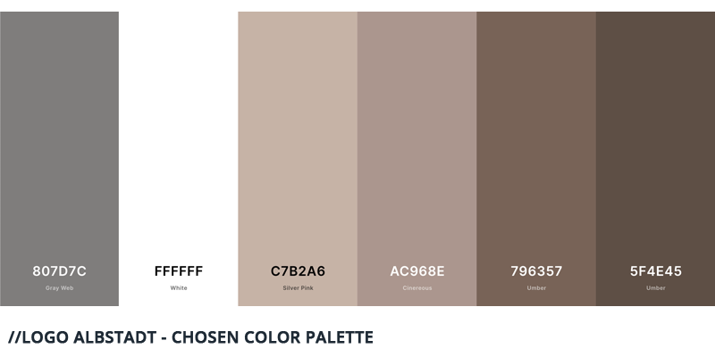

## The idea

My sister has been a speech therapist for a few years before she decided it is time to start her own speech therapy office. With this decision came many exciting questions: What would the name be? What design had she in mind? I loved this opportunity to help her with designing a company identity as well as translating the designs into an actual homepage.

This post is about the full design journey, starting with her ideas until the launch of the React-based website.

## Post overview

1. Identity and values
2. Vibe and color palette
3. Logo and design
4. Wireframes and iterations
5. Building the site with Gatsby

## Identity and values

We started out with a basic question: **What values do you want to convey with your speech therapy office?**

My sister particularly enjoys working with children and wants to ensure that they feel safe - something that is especially important when dealing with impediments the kids are ashamed of. Therefore, emotions of "being in a good place" and feeling "just as comfy as at home", coupled with perceptions of it not "being as cold as a doctor's office", yet "professional and individualized to each patient" were the core elements of the values she wants to portray.

## Vibe and color palette

Once this foundation was set, we turned towards the design and logo derived from it. What preceded this step was the naming of her speech therapy office which ended up following a simple recipe: "logo" (for Logopädie, the German verb for speech therapy) and "albstadt", the name of the city.

Less straight forward was the design we wanted to follow. Looking at the many speech therapy websites out there, a few themes quickly emerged:

- **The doctor's office**: Kept mostly in blue-green shades, these pages derived their design from a more medical perspective on speech therapy

- **The cute ones**: Many pages were tailored to kids and adopted this in their design: colorful, peppy and playful is their theme

- **The bold ones**: For this one, a bold appearance with loud colors and stylish appearance was chosen.

In the larger comparison, only few pages however choose a calmer design with more earthy tones. Having gained few inspirations from the competition, we took an alternative route and started to look for moodboards. Ignoring the actual content, we collected many different pictures that gave off the vibe we were looking for.

With these moodboards in hand, we experimented with a few color palettes and finally ended up on a palette of warm earth tones, embedded in generous white space.

They perfectly capture the calmness and safety that patients experience during the therapy with my sister, while simultaneously portraying professionalism and classiness.

## Logo design

With the color palette in hand, we turned towards the logo. In order to avoid giving the brand a too "classy" feeling, and keeping a hint of playfulness, we allowed us some more leeway within the logo design. Returning to the core values, the logo should portray a calm but focused, individualized and effective, playful but still professional approach to therapy.

The puzzle piece as central symbol captured many of these values: Part of a calm past time, part of a bigger project, yet often individual in shape.

Around the puzzle pieces we drew a circle as unifying factor, holding the pieces together and added a dot next to the name that symbolizes how all pieces of the therapy and the progress associated with it converges at her speech therapy office.

After some iterations, the final logo was defined:

It's layout allows it to be used in versatile ways. It works great in a single color on textiles, the puzzle circle can be isolated for simpler or reduced imagery and the distinct type would still be recognizable without the other logo elements.

## Wireframes and iterations

With name, values, color palette and logo in hand, it was time to turn towards the website design itself. I utilized Figma in order to create the base layout. The website was planned with only few major pages in mind:

- **The main landing page**: This was planned as the main page with all crucial information. It would provide a gentle intro to speech therapy and the office and place crucial information (phone, appointments) bright and center.

- **Detail info page**: On this page more information around speech therapy, the core principles of her office and the typical process of a speech therapy can be found. This page was aimed for visitors who would like to know more. In our base research we found that many websites drown the user with medical explanation text and provide a real challenge to finding core info, which was the main reason this was outsourced to a second page.

- **Contact options**: A simple contact form with the addendum of allowing to give appointment preferences for easier scheduling.

The design itself aimed to be the full implementation of all aspects outlined above. Supported by the earthy, warm tones, I utilized waves and curves as central design elements which were filled with gradients of our color palette. This provided a natural way to segment off the different elements of the webpage while also looking pleasant.

## Building the site with Gatsby

After finalizing the design, the last step was "only" to build the webpage. I have dabbled with JS-based frontend frameworks before but have not had the chance to build a static website that utilizes many of the core advantages of these frameworks. Gatsby, a framework based on React but built for static websites was the perfect choice. As I expect only few changes to the website itself, no CMS was implemented.

Building the website with Gatsby was the largest learning opportunity within this project for me, so I dediced to forego any starter code and build the website from scratch. This approach is definitely visible in the source code and, as always, with my gained knowledge at the end of the process, I would have done many things differently.

The core area for improvement is around either creating a better CSS framework or utilizing one of the many existing CSS frameworks. This become especially obvious once I turned towards making the site responsive and had to turn to more "hacky" approaches.

Another challenge I overcame was the inclusion of the wave elements. The waves themselves were all created within Figma and exported as SVG. Due to their nature, however, placing text within them proved to be difficult, as I decided to scale the SVGs with the screen widths, therefore changing the amplitude of the waves. One key solution for a particularly tricky wave was to cut it into three pieces: the top wave, the square middle part and the bottom waves and placing the text only in the square middle part.

Lastly, implementing SEO best practices is an ongoing learning journey and I am curious to see how well the website will place within Google results.

The website itself is hosted on Netlify's free tier, as it allowed me the option to build the website straight from Git and host it for free. The provided traffic in the free tier should cover the expected traffic.

## Conclusion

Undergoing the full journey of identifying core values, defining the brand based on them, distilling these into a logo, combining all of it into a design that I also had to implement, was a long but satisfying experience.
