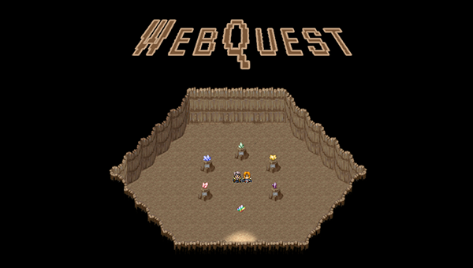
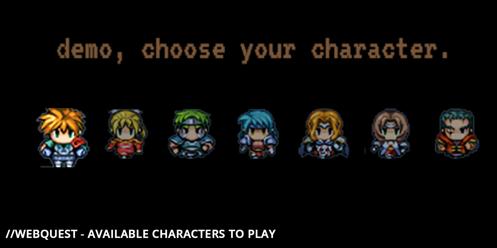
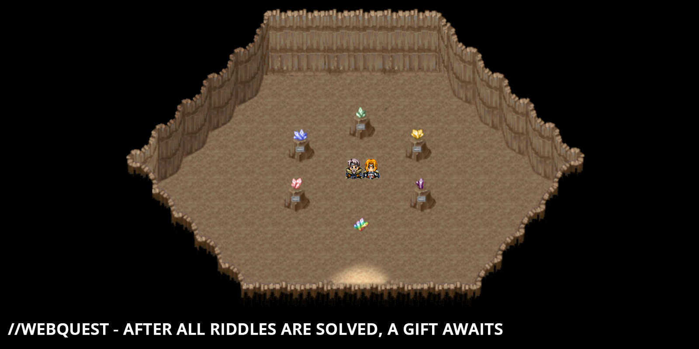

## The idea

During a two week period without any real ongoing projects, I wanted to make a first foray into JavaScript. I found PhaserJS as an interesting game development engine and decided to start a mini-game project.

The base idea of WebQuest is you are brought to a mini-place, asked to solve five riddles to get a reward. It can be sent to friends and family to provide a fun way to deliver a gift.

## Post overview

1. Design idea
2. Translating design into code
3. Checking submissions
4. Logo and design

## Design idea and implementation

With the scope clearly marked (learning within a small project), the core design of the game could not be overly complicated. 8-bit graphics have a large fandom and is especially thriving within the indie scene due to its low hurdle to get into. The success of games such as Stardew Valley have shown the appeal of these graphics to gamers.

The main appeal of 8-bit graphics for this project was the short time to get started on it. Phaser provides an easy way to split a sprite sheet (all possible animations for a character captured in a single file) and using existing assets, the setup is quick.

For the main game element, the riddles, a simple aesthetics was chosen: A player has to collect five gems, and each gem sits on a pedestal. Once a player clicks on one, they are given the option to type their solution, if correct, the gem stone appears.

This provides an intuitive and easy way to track plus a sense of achievement for each solved riddle.

## Translating design into code

After the core design was sketched out, the development started. First, the base level was mapped out by creating the map in Adobe Photoshop and marking the boundaries in Phaser.

Then, the characters were introduced and the basic animations (movement) were programmed. I opted to only allow movement with the arrow keys to avoid an additional key mapping (e.g. the WASD) keys.

That step was followed by setting up the core logic of displaying content (text bubbles) and a logic system to move from one text field to the next. This was a major challenge and my approach is more than scrappy.

For potential future improvements, I'd read up on best practices on how this is usually solved. The chosen approach gave each text bit an id and within the JSON containing all text, follow-up fields were marked. Once a text was displayed, Phaser would look up the next id (or "end") and continue the dialogue based on that.

### Checking submissions

One interesting puzzle to crack was to determine a "safe" way to check submissions. A few people I intended to send this to were technically savy. Putting the solution as clear text string into the code was not a desired option. Drawing inspiration from password management, I decided to simply create a MD5 hash of the solution.

After each input, Phaser would run the entry through the same hasher and compare outputs. Only if the hash matches, the status would change to "solved".

### Creating Menu and Credits

Lastly, the game was wrapped into a start menu and credits screen with little mini features here and there (e.g. the main character walking away from the screen after the game ended). These were mainly used as mini-exercises for myself (in this case to practice opacity, scaling and animations).

## Hosting

The hosting of WebQuest could not be easier: The game is run off a single index.html file and due to it being completely self-contained, does not require any further infrastructure.

A demonstration of the game can be found at:
https://kftb.github.io/webquest/

## Outlook

The game was mainly created as a learning experience. There are a few improvements that I'd prioritize were I to come back to it:

- **Implement WASD keys**: Many gamers automatically move to WASD keys for movement which provides an initial negative reaction when these do not work. Gamers might miss the initial note on using the arrow keys, this would therefore be the first improvement.

- **Improved animations**: A few UI elements and animations are a bit clumsy, such as leaving the cave after successful completion (just a screen appearing instead of the figure disappearing), or the input field (having to hit enter twice) or smaller character animations (more expressive sprite animations instead of just movevement). All of these would enhance the gaming experience through single quality-of-life improvements.

- **More modular code**: The JSON file as main location for all text and riddles makes the setup already easily customizable. A few single elements have not been completely outsourced or not as well integrated, such as the number of characters of the solution word (not in the JSON but hard coded) or the integration of the player name into some of the dialogues.

## Conclusion

Programming this mini-game was a super-fun exercise, especially with my focus of getting an MVP out as fast as possible. The result is a working implementation of a game, with admittedly more than scrappy code. The initial goal of it being a learning experience, was however more than achieved!

